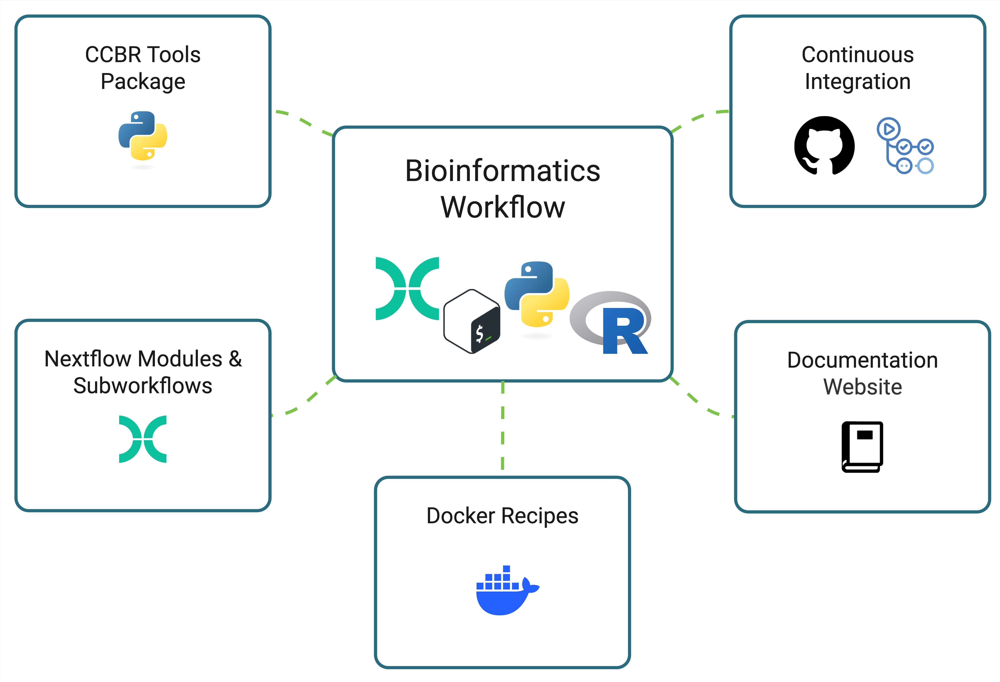
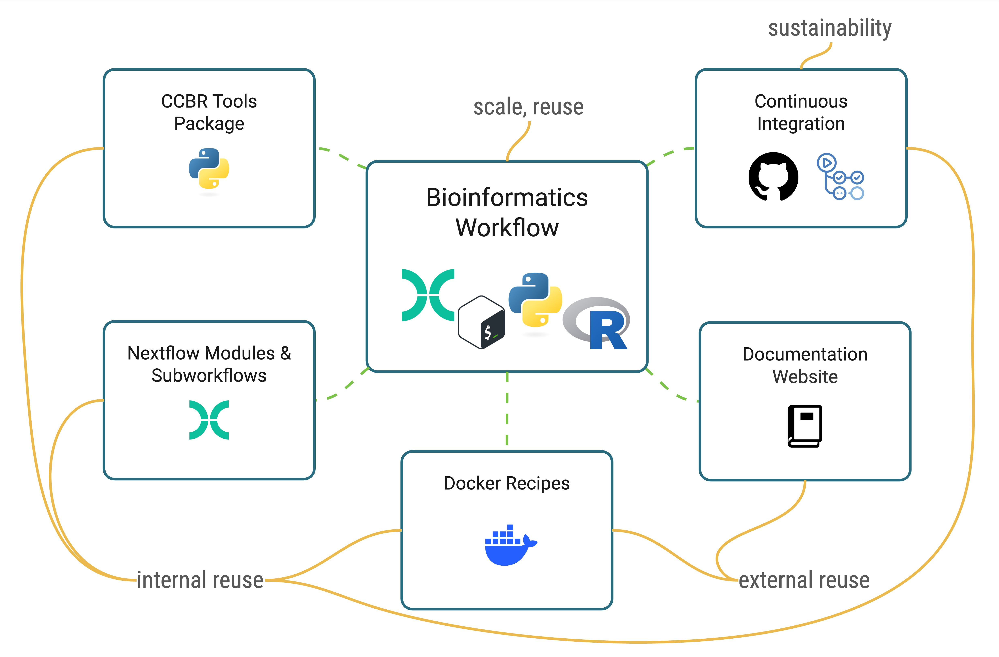

# reproducible-toolchain

<!-- this file is generated from README.qmd. please edit README.qmd only. -->

Anatomy of a modular toolchain for reproducible bioinformatics workflows 

Template Repository: <https://github.com/CCBR/CCBR_NextflowTemplate>

### Presentations

This project has been presented in a few forums:

- [ISMB Bioinformatics Open Source Conference 2026 (poster)](poster/BOSC-2026.qmd)
- [Reproducibility in Science 2026 (poster)](abstract/reproducibility-2026.qmd)
- [ABCS Technical Workshop 2026 (talk)](slides/abcs-tech-workshop-2026-05.qmd)

## Abstract



## The Toolchain

<https://github.com/CCBR/CCBR_NextflowTemplate>

## License

This software is licensed under [the MIT license](license.md).
Text and images included in this repository are licensed under the 
[CC BY-SA 4.0 license](https://creativecommons.org/licenses/by-sa/4.0/).

## Citation

View the [citation file](CITATION.cff) for the citation information for this project.
