## Reproducible Bioinformatics

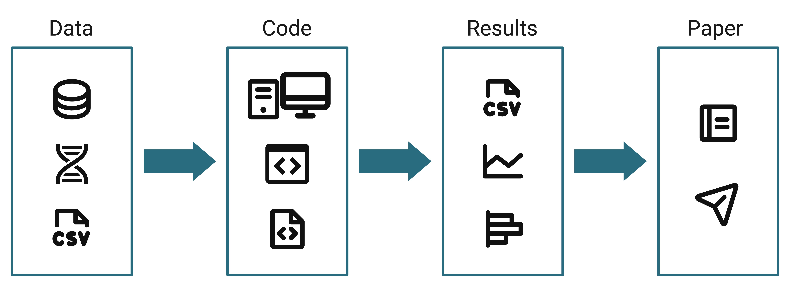

:::{.notes}
- scientists generate large datasets
- we need computer programming in order to analyze the data and produce results, which then are interpreted and summarized in scientific papers
:::

## Reproducible Bioinformatics

- **Reproducibilty** is the ability to repeat an analysis with the same methods on the **same data** and get the same result
- **Replicability** is the ability to repeat an analysis with the same methods on **different data** and get the same result

<br>

:::{.fragment}
| Methods           | Same data       | Different data    |
|-------------------|-----------------|-------------------|
| Same methods      | Reproducibility | Replicability     |
| Different methods | Robustness      | Generalizability  |
:::

::: footer
Schloss PD. 2018. [10.1128/mBio.00525-18](https://doi.org/10.1128/mBio.00525-18).
:::

:::{.notes}
- reproducibility is the first step in validating research results. it's the minimum required to show that results are valid.
- in order for your work to have a chance of being replicable, it must first be reproducible
- reusability
- robustness
- generalizability
- generalizability is the ultimate goal: that insights from our work ultimately are applicable outside of basic science and into translational practice
:::

## Enabling Reproducibility

In order for a computational biology study to be reproducible, other people must be able to run the analysis code themselves.

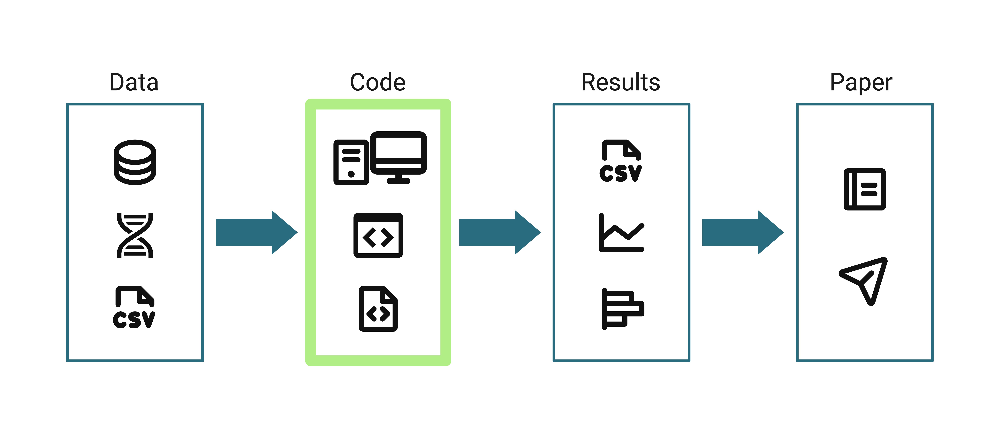

:::{.notes}

- our team consists of bioinformatics analysts who write code to perform data analysis, and bioinformatics software engineers who develop reusable software used by the analysts
:::


## Enabling Reproducibility: Bare Minimum

- Share the code publicly
- Document how to run the code

## Minimal Reproducibility

- Share the code publicly
- Document how to run the code

### Beyond Minimal Reproducibility

#### Scalability, Reusability, & Sustainability

- Ensure the code **scales** for large datasets
- **Reuse** components of your code, and ensure others can reuse it too
- Adopt maintenance practices to **sustain** the project for the long term

:::{.notes}
- Beyond Minimal Reproducibility: Code Quality concepts
- internal & external reusability
- automate as much as possible
- it turns out that these practices can also make your life easier when you need to update software, try out different parameters, or fix bugs in your code!
:::

## CCBR Pipelines

#### On the Biowulf HPC

`$ module load ccbrpipeliner`
```
PIPELINES:
ASPEN		v1.1	ATAC-seq			https://ccbr.github.io/ASPEN/1.1
CARLISLE	v2.7	CUT&RUN				https://ccbr.github.io/CARLISLE/2.7
CHAMPAGNE	v0.5	ChIP-seq			https://ccbr.github.io/CHAMPAGNE/0.5
CHARLIE		v0.12	circRNAs			https://ccbr.github.io/CHARLIE/0.12
CRISPIN		v1.2	CRISPR				https://ccbr.github.io/CRISPIN/1.2
ESCAPE		v1.2	EV-seq				https://ccbr.github.io/ESCAPE/1.2
LOGAN		v0.3	whole genome seq	https://ccbr.github.io/LOGAN/0.3
RENEE		v2.7	bulk RNA-seq		https://ccbr.github.io/RENEE/2.7
SINCLAIR	v0.3	scRNA-seq			https://ccbr.github.io/SINCLAIR/0.3
XAVIER		v3.2	whole exome-seq		https://ccbr.github.io/XAVIER/3.2

TOOLS:
spacesavers2	v0.14			https://ccbr.github.io/spacesavers2/
permfix			v0.6			https://github.com/ccbr/permfix/
ccbr_tools		v0.4			https://ccbr.github.io/Tools/
```

:::{.notes}
we develop and maintain a whole suite of pipelines for the analysis of all kinds of sequence data.
:::

## How can we develop bioinformatics workflows that are scalable, reusable, and sustainable to maximize reproducibility?

## Toolchain for Reproducible Bioinformatics

:::{.align-center}
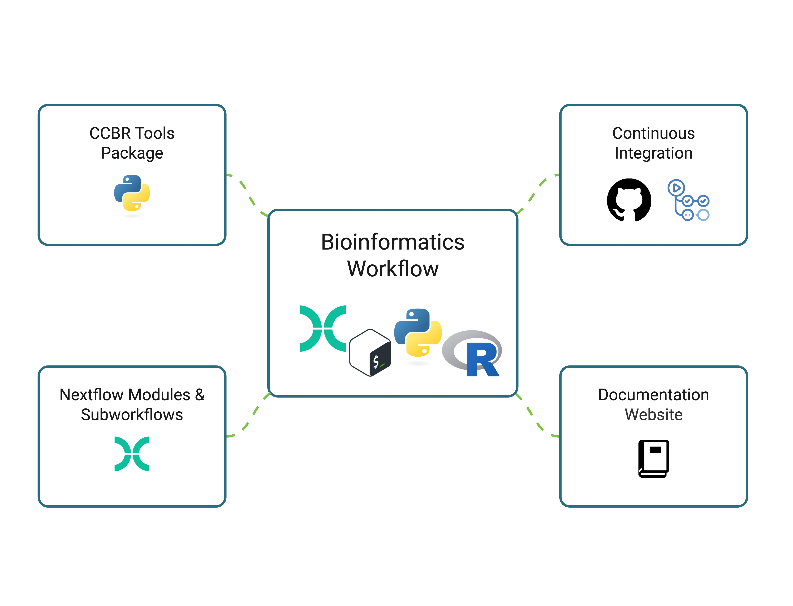{width=80%}
:::

:::{.notes}
- at the heart is the bioinformatics workflow
- we'll also talk about several components of our toolchain that interface with the workflow
:::

## The Bioinformatics workflow

Example workflow diagram from CHAMPAGNE: ChIP-seq pipeline



::: footer
<https://github.com/CCBR/CHAMPAGNE>
:::

:::{.notes}
each step could be as simple as a command to run another piece of software,
or a shell script, or a more complicated script in another language like
R or Python for custom data processing.
the simplest workflow is just a series of commands, but when you want to scale
up to larger datasets and support different paramters, you need to consider using
a workflow management language like nextflow or snakemake.
:::

## The Bioinformatics workflow
### Nextflow for scalable orchestration

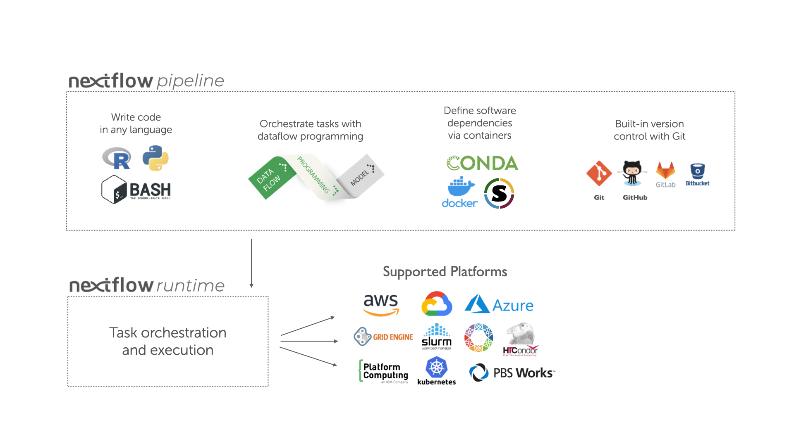

::: footer
<https://carpentries-incubator.github.io/workflows-nextflow/01-getting-started-with-nextflow.html>
:::

:::{.notes}
- data flow programming means steps run when they need to and run in parallel where possible
:::

## Workflow template for new pipelines

:::: {.column width="60%"}
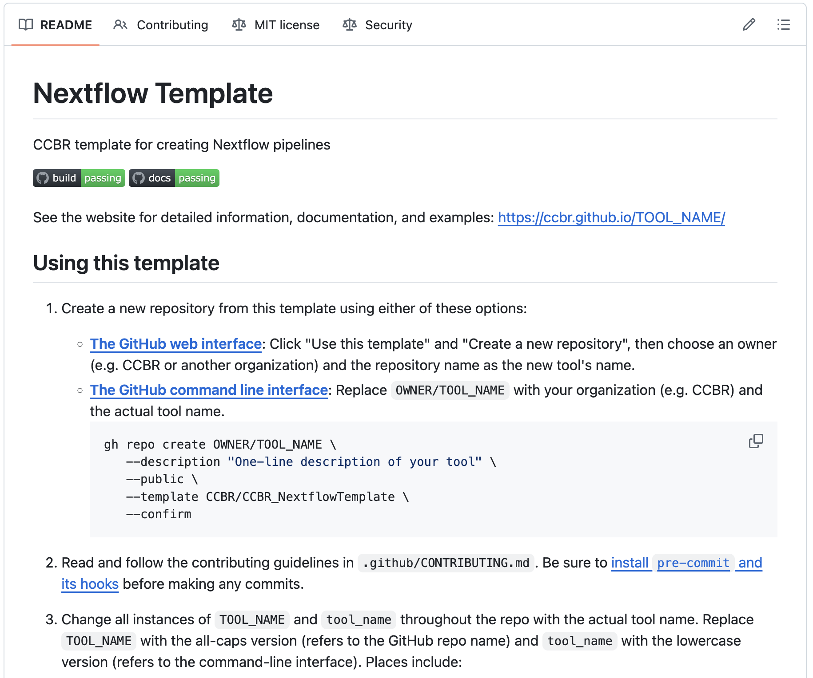
::::

:::: {.column width="30%" .align-right}
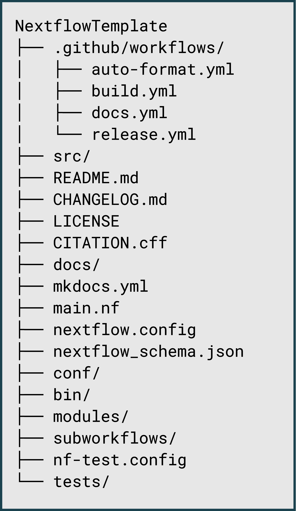
::::

::: footer
<https://github.com/CCBR/CCBR_NextflowTemplate>
:::

## Workflow template for new pipelines

:::: {.column}
::::
:::: {.column width="45%" .align-right}
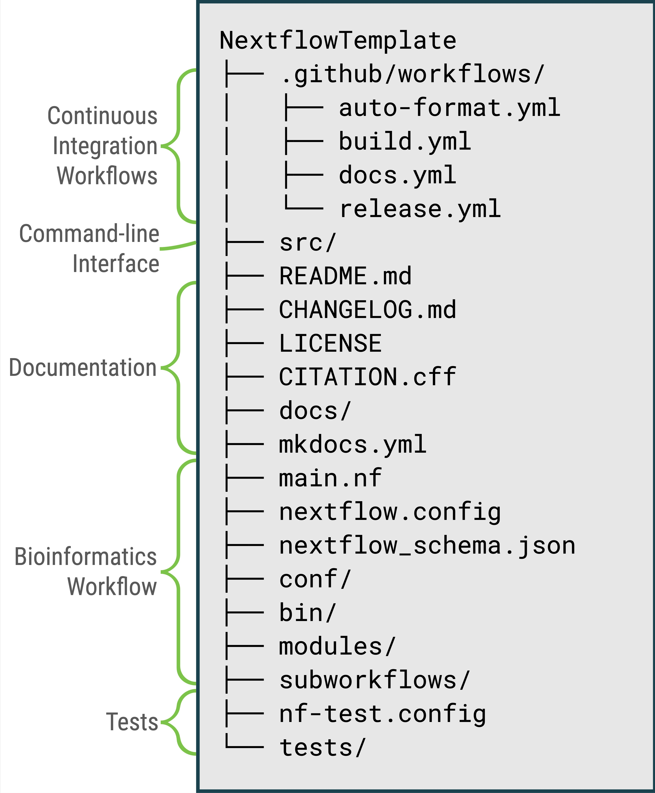
::::

::: footer
<https://github.com/CCBR/CCBR_NextflowTemplate>
:::

:::{.notes}
- our template contains a standardized file structure with the initial components needed to interface with the rest of our toolchain
- anatomy of our workflow template
:::

## The Command-line Interface

Nextflow native interface
```sh
nextflow run ./path/to/CCBR/CHAMPAGNE \
  -profile biowulf,slurm,singularity \
  --input /data/$USER/chipseq-project/data/samplesheet.csv
  -resume
```

::: {.fragment}
CCBR custom interface
```sh
champagne run \
  --input /data/$USER/chipseq-project/data/samplesheet.csv
```
:::

::: {.fragment}
Same interface, different pipeline
```sh
sinclair run \
  --input /data/$USER/scrna-project/data/samplesheet.csv
```
:::

## The Command-line interface


## Python Package

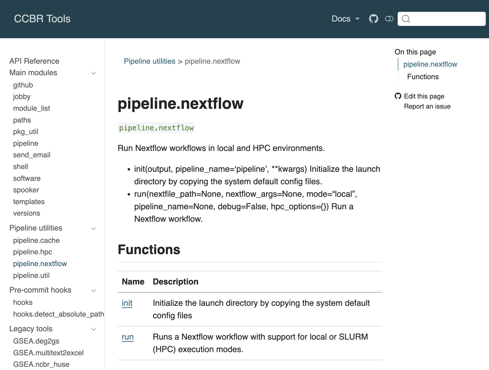

::: footer
<https://github.com/CCBR/Tools/>
:::

::: {.notes}
- re-use boilerplate CLI code across instances of the template.
- streamline maintenance. fix a bug in the package, bump the version, and then every repo that depends on it will have the updates.
:::

## Nextflow modules & subworkflows

Modular design enables code re-use

:::{.column}
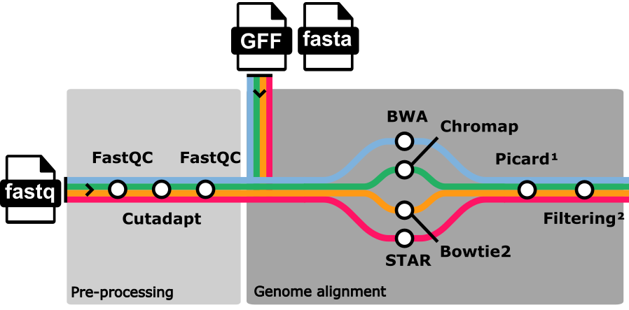
:::

:::{.column}
::::{.fragment}
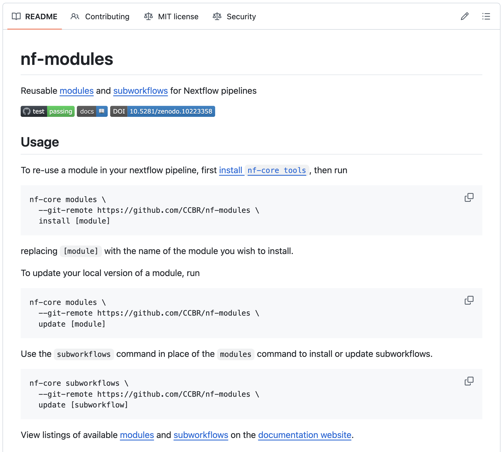
::::
:::

::: footer
left: <https://nf-co.re/chipseq/2.1.0/> | right: 
<https://github.com/CCBR/nf-modules>
:::

## Docker containers

Dependency management: solved

:::{.align-center}
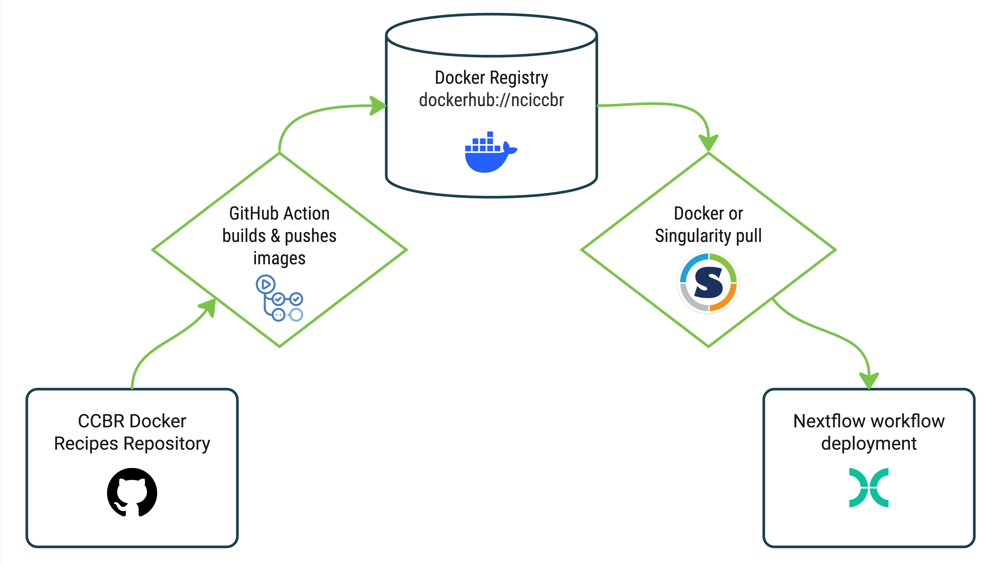
:::

## Contribution Process

Sustainable development practices for high-quality code

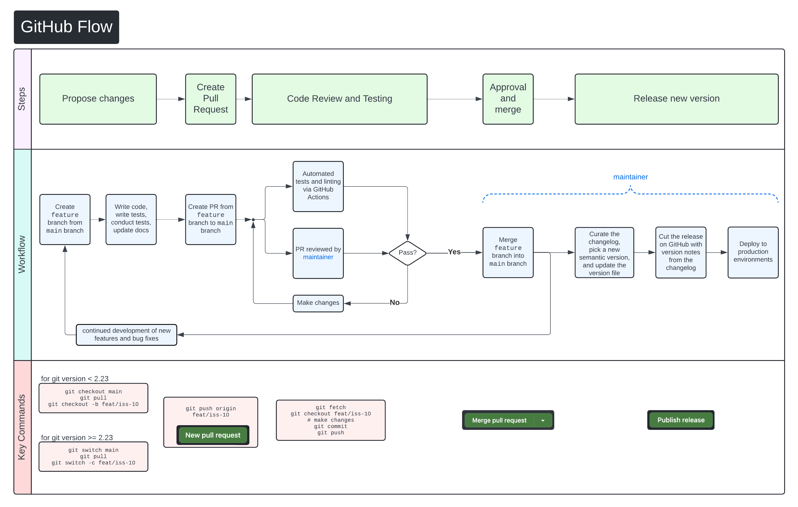

## Contribution Process: Pull Requests

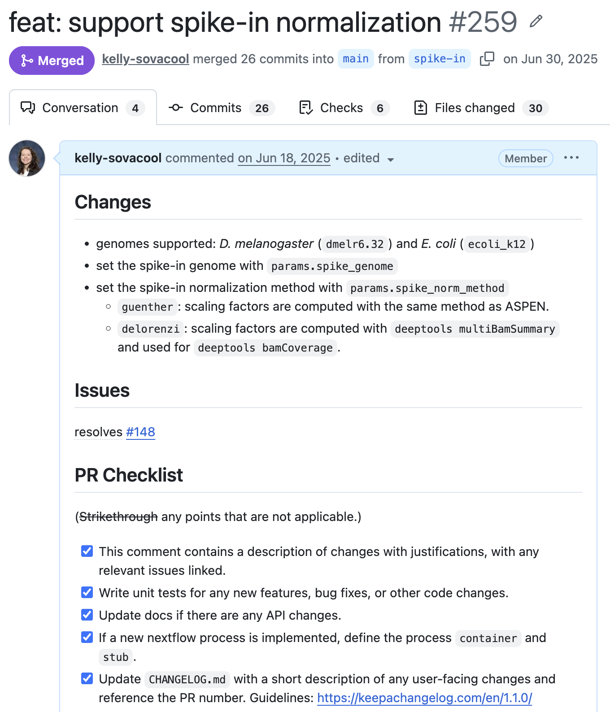

:::{.notes}
template with a space to describe changes, link to relevant issues, and a checklist
:::

## Contribution Process
### Code review checklist

- [x] The code is clear, concise, readable, and follows best practices.
- [x] Unit tests demonstrate that the code works.
- [x] If the code changes how the software behaves for users, the documentation is also updated.
- [x] All of the continuous integration (CI) checks pass.

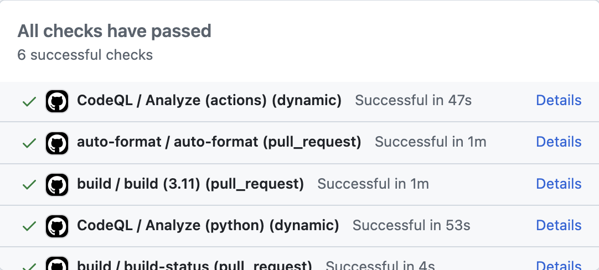

## Continuous Integration

- Integrate source code changes frequently
- Ensure the main branch is always in a working state

::::: {.fragment}

### GitHub Actions runs CI checks on every change

:::: {.layout-ncol=2}

::: {.column}
- [x] Unit & integration tests, code coverage report
- [x] Code quality checks
- [x] Render documentation
:::

::: {.column}
{width="40%"}
:::

::::

:::::

::: {.notes}
- nf-test for nextflow, pytest for python, testthat for R.
- code linters and formatters like ruff, air, styler, prettier.
- make sure the docs can be rendered on PRs. actually deploy them on pushes to main.
:::

## Deploy Documentation with GitHub Pages

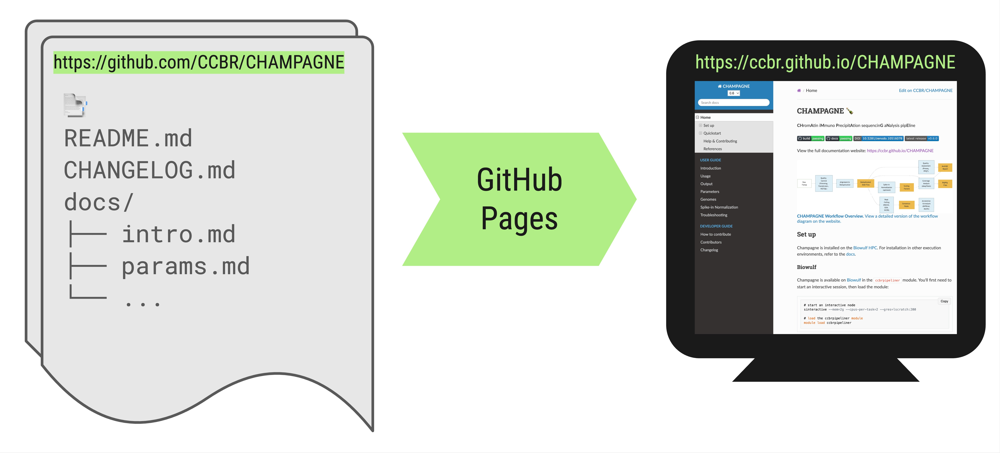

## Continuous Integration
### Reusable GitHub Actions

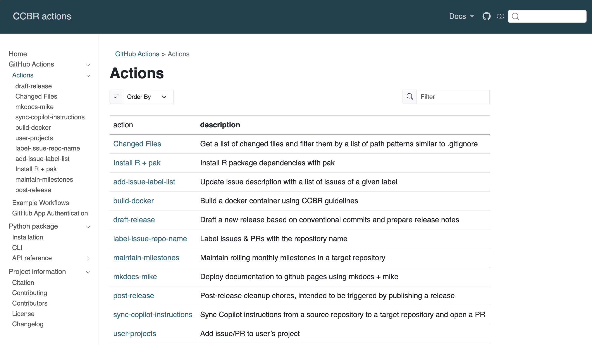

::: footer
<https://github.com/CCBR/actions>
:::

## Anatomy of our workflow template

:::{.align-center}
{width="40%"}
:::

## Anatomy of our workflow template

:::{.align-center}
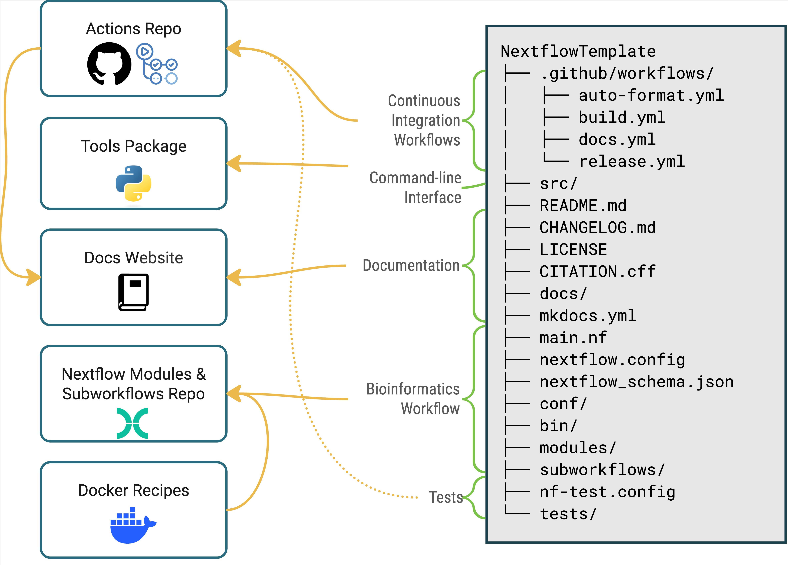{width="70%"}
:::

:::{.notes}
- every part of the template uses a component of our modular toolchain
- starting from this template means every new pipeline we create follows this same structure
:::

## Scalable, Reusable, Sustainable, Reproducible Bioinformatics

:::{.align-center}
{width=80%}
:::

:::{.notes}
- Modern workflow management (nextflow) for scalability
- Modular design for internal reusability
- Robust documentation for external reusability
- Continuous integration and disciplined maintenance practices for long-term sustainability
- Using our template repository means we are committed to this same structure and set of practices on every new workflow we set out to create.
:::

## Scalable, Reusable, Sustainable, Reproducible Bioinformatics

:::{.align-center}
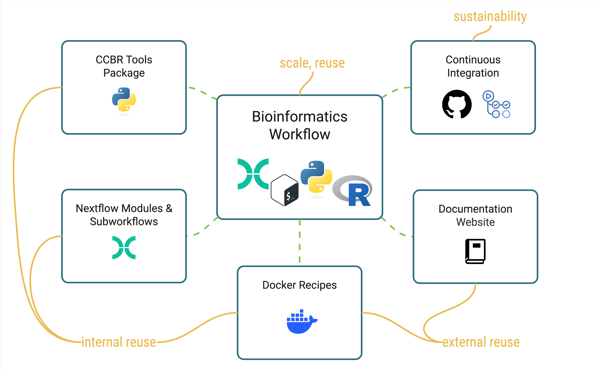{width=85%}
:::

:::{.notes}
- Modern workflow management (nextflow) for scalability
- Modular design for internal reusability
- Robust documentation for external reusability
- Continuous integration and disciplined maintenance practices for long-term sustainability
- Using our template repository means we are committed to this same structure and set of practices on every new workflow we set out to create.
:::

## Resources

- These slides: [[HTML](https://ccbr.github.io/reproducible-toolchain/slides/abcs-tech-workshop-2026-05.html#/title-slide)] [[Source](https://github.com/CCBR/reproducible-toolchain/blob/main/slides/abcs-tech-workshop-2026-05.qmd)]
- Related talk: [Organizing and documenting NGS pipelines on GitHub](https://bioinfo-abcc.ncifcrf.gov/training/event/organizing-and-documenting-ngs-pipelines-on-github-building-549-executive-board-room-nci-frederick-1204241200) | ABCS Programmer's Corner, 2024
- [CCBR Nextflow Template](https://github.com/CCBR/CCBR_NextflowTemplate)

## Discussion

- What barriers to reproducibility do you face in your development & analysis projects?
- How can you reduce repetitive code in your own projects?
- Would your team benefit from developing your own reusable packages and template repositories?
- Are you taking advantage of GitHub's features like Actions and Pages?
- Is your contribution process helping maintain code quality?
- Are there any tools or processes you would add to this stack?